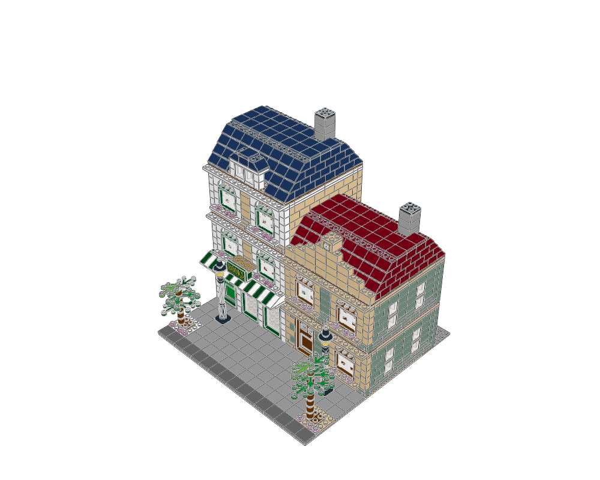

# LDraw generation tools

Generate modular MPD scenes with thousands of real part placements, inspect their assemblies and connections, and check the result with Python and LeoCAD.

For **stud-built vehicles**, start with the [vehicle workflow](docs/agent/vehicles.md)
and [vehicle atlas](examples/vehicle-atlas/README.md). The toolkit includes measured
wheel packages, seven editable designs spanning cars, trucks, motorcycles, boats
and aircraft, dedicated fitting recipes, vehicle palettes and family-specific checks. Technic mechanisms are outside this workflow.

```sh
./ldraw-agent vehicle list
./ldraw-agent vehicle plan grand-tourer --output output/tourer.plan.json
./ldraw-agent build output/tourer.plan.json --output output/tourer.mpd --detail summary
./ldraw-agent vehicle check output/tourer.mpd
./ldraw-agent render output/tourer.mpd --outdir output/tourer-review --views home front back right top bottom
```

For visual design, start with the [design guide](docs/agent/visual-design.md). The supplied categories now support descriptive refs and named colours directly in plans, bounded search with live dimension checks, role-based palettes, reusable architectural details, and LeoCAD part-selection boards.

For connector-based assembly, start with the [shadow and snapping guide](docs/agent/snapping.md). The supplied `offLibShadow/` loads automatically. Discover connector IDs with `connectors`, preview and apply checked part/submodel snaps with `snap`, or use `snap` placements in JSON plans. Try [shadow-snap.plan.json](examples/shadow-snap.plan.json).

For complex scenes, start with the [Bookshop case study and module workflow](docs/agent/complex-models.md), its [measured assembly inventory](docs/agent/resources/bookshop-study.json), and the original [Copper Lane generator](examples/modular-street/README.md). Plans support nested includes, attributed MPD assets, named attachment frames and regular repeats. Inspection supports selected sections and bounded reports; embedded DAT parts resolve without inflating physical BOM counts.

Start an agent with [instructions.md](instructions.md). Read the [tool reference](docs/agent/tooling.md), [LDraw rules](docs/agent/ldraw-reference.md), and [geometry guide](docs/agent/geometry.md). The mandatory source is [docs/ldraw-specs.pdf](docs/ldraw-specs.pdf); the [source map](docs/agent/specification-map.md) links rules to its pages.

Requires Python 3.12+, Poppler's `pdftotext`, and the supplied LDraw library. LeoCAD is required for visual review. `mpd2glb.sh` is optional for Blender inspection. The setup uses a project virtual environment and caches; it does not change the official library or global application settings.

```sh
./setup.sh
./ldraw-agent build examples/bridge.plan.json --output output/bridge.mpd --report output/bridge.build.json
./ldraw-agent validate output/bridge.mpd --geometry --strict
./check-model.sh output/bridge.mpd
./ldraw-agent render output/bridge.mpd --outdir output/bridge-review
.venv/bin/python -m pytest -q
```

Open the PNGs for visual review. The checked source is also included as [examples/bridge.mpd](examples/bridge.mpd). The example intentionally demonstrates nested submodels, inherited colours, rotation, steps, and stud stacking with only five parts. Use `--force` to regenerate an existing example. For reproducible transitive dependencies, use `uv sync --locked --extra test`; `uv.lock` is included. `setup.sh` uses it when `uv` is installed, with pip as a fallback. On macOS, install Poppler with `brew install poppler` if needed.

Defaults resolve relative to this repository: `../ldraw-lib/ldraw` and `../ldraw-lib/models-annotated`. Override with `LDRAW_DIR`, `MODELS_DIR`, or the CLI's `--library` / `--models` options before the command.

The implementation reuses [pyldraw3](https://github.com/hbmartin/pyldraw3) for parsing, writing, geometry expansion, BOMs, and connector inference; NumPy for matrix/geometry checks; JSON Schema for generation plans; the existing SQLite model index for retrieval; Poppler for the supplied PDF; and LeoCAD for renders. Local validation fills gaps needed by the documented assembly workflow. These are checks and review evidence, not a proof of physical buildability. See the explicit [coverage and repair guide](docs/agent/validation.md).

## Detailed street example

```sh
.venv/bin/python examples/modular-street/generate.py
./ldraw-agent build examples/modular-street/scene.plan.json --output output/copper-lane.mpd --detail summary
./ldraw-agent render output/copper-lane.mpd --outdir output/copper-lane-review
./ldraw-agent compare-bom output/copper-lane.mpd --csv output/copper-lane-review/leocad-bom.csv
```

The default scene has 1,655 placements across nineteen FILE blocks: a botanical bookshop and sand-green townhouse with arched flower windows, striped awnings, a gold BOOKS sign, a dormer, a stepped clock pediment, layered foliage and furnished removable floors. See the [before/after review](examples/modular-street/visual-review.md) and [design brief](examples/modular-street/design-brief.json).



Read the [verification record](docs/agent/verification.md) for tested scope, contact/collision limits, and defects found in the annotated Bookshop reference. LeoCAD snapshots use a temporary library for embedded DAT definitions; original libraries and source models remain unchanged.
