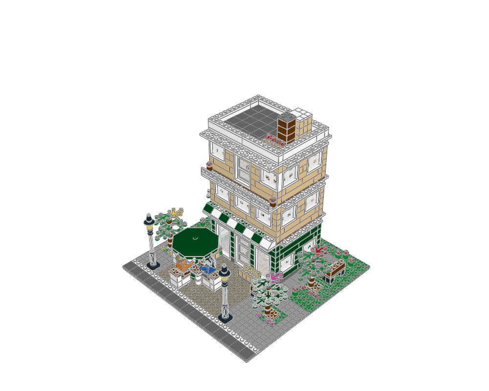
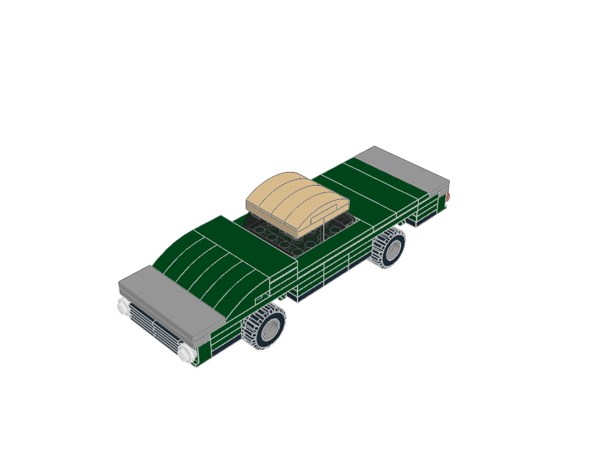
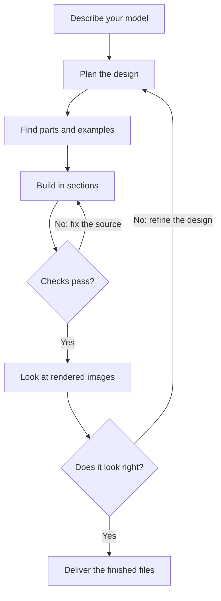
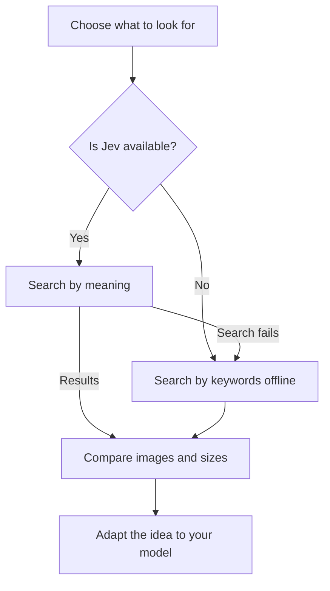

# ldraw-astra

**Give an AI agent a model idea. Get an editable brick model, a parts list and preview images.**

ldraw-astra provides the tools, examples and instructions an agent needs to design models with real LDraw parts. It helps the agent find suitable pieces, build in sections, check its work and improve the result by looking at rendered images.

LDraw is a format for digital brick models. An `.mpd` file holds a model and its smaller assemblies in one editable file.

**Using an agent? Start it with [instructions.md](instructions.md) and your model request.** This README explains the project; that file guides the agent through the work.

| Buildings | Gardens and landscapes | Vehicles |
| --- | --- | --- |
| [](examples/copper-bean/README.md) | [](examples/sakura-garden/README.md) | [](examples/vehicle-atlas/README.md) |
| [The Copper Bean](examples/copper-bean/README.md) | [Sakura Garden](examples/sakura-garden/README.md) | [Vehicle examples](examples/vehicle-atlas/README.md) |

Examples include buildings, street scenes, cars, trucks, motorcycles, boats and aircraft. [Technic structures](examples/technic-atlas/README.md) add frames, chassis, towers and supports for stud-built bodies. This first Technic stage covers static assemblies; mechanisms remain a separate, later stage.

## From an idea to a model

The agent makes the design choices. The tools help it build, measure, check and render those choices. The process includes two kinds of review: checking the construction and looking at the design.



Review the shape, colours, details and fit to the brief. For a large model, check individual sections before the complete scene. Keep changes in the plan or Python generator so the model can be rebuilt.

The delivery includes the **model**, its **editable source**, a **parts list** (BOM), **check reports** and **reviewed images**. Passing checks provides useful evidence; physical strength, stability and every connection still require judgement. See [what validation covers](docs/agent/validation.md).

## Find better parts and building ideas

The agent can learn from three levels of reference: a **whole model** for proportions, a **submodel** such as an engine or window for construction, and a **single part** such as a seat or windscreen for detail.

Start with the [reference examples](examples/reference-atlas/README.md). When more options are needed, search the local collection:



Optional semantic search uses Jev from TypeSafe to find descriptions that match an idea. Agents [check its availability first](docs/agent/reference-discovery.md#check-jev-availability-before-searching) and explicitly use `--engine fts` for offline keyword search when it is unavailable. Existing examples, building tools and rendering remain usable.

Explore **21 inspected constructions** and **two adjustable recipes**, or generate an image catalog of **220 selected references**. The [reference discovery guide](docs/agent/reference-discovery.md) explains how.

## Get started

### 1. Set up the tools

You need **Python 3.12+**, **Poppler** (`pdftotext`), **LeoCAD** and the **LDraw part library**. The rendering workflow has been tested on macOS. `uv` is recommended for installing the locked Python dependencies; `setup.sh` also supports a pip fallback.

The default local resource layout is:

```text
workspace/
├── ldraw-astra/                # this repository
└── ldraw-lib/
    ├── ldraw/                 # official LDraw part library
    ├── models-annotated/      # reference models, for discovery
    └── scripts/ldraw-info.db  # searchable descriptions, for discovery
```

Use `LDRAW_LIB_DIR` for a different library-repository location, or `LDRAW_DIR` and `MODELS_DIR` to set the part and model directories separately. Model discovery uses the annotated sources and database; building an included example needs the part library.

From the repository root, run:

```sh
./setup.sh
```

Setup installs Python packages in `.venv`, checks the environment and prepares local indexes. The [tool guide](docs/agent/tooling.md) covers configuration and individual commands.

### 2. Give your agent a brief

Use an agent that can read files and run commands in this repository. For example:

> Read instructions.md and build a compact delivery van in dark blue with a cream roof. Include seats, a steering wheel and a cargo area. Save the model, editable source, checks, parts list and reviewed images under output/.

Describe the subject, approximate size, style and details that matter to you. The agent follows [instructions.md](instructions.md) to plan, build, check and refine it.

### 3. Or try a small example yourself

This five-part bridge demonstrates the build, check and render loop:

```sh
./ldraw-agent build examples/bridge.plan.json --output output/first-model.mpd
./ldraw-agent validate output/first-model.mpd --geometry --strict
./ldraw-agent render output/first-model.mpd --outdir output/first-model-review
./ldraw-agent compare-bom output/first-model.mpd \
  --csv output/first-model-review/leocad-bom.csv
```

Open `output/first-model.mpd` in LeoCAD and the PNGs in `output/first-model-review/`. The last command compares the toolkit's parts list with LeoCAD's. Add `--force` to the build command when intentionally replacing a previous result.

## Where to go next

| I want to… | Read… |
| --- | --- |
| Ask an agent to generate a model | [Agent instructions](instructions.md) |
| Improve shape, colour and detail | [Visual design guide](docs/agent/visual-design.md) |
| Build vehicles | [Vehicle workflow](docs/agent/vehicles.md) and [examples](examples/vehicle-atlas/README.md) |
| Build Technic structures | [Structural workflow](docs/agent/technic.md) and [examples](examples/technic-atlas/README.md) |
| Find parts and reusable constructions | [Reference discovery](docs/agent/reference-discovery.md) and [reference atlas](examples/reference-atlas/README.md) |
| Organize a large model | [Module workflow](docs/agent/complex-models.md) and [Copper Lane example](examples/modular-street/README.md) |
| Understand connections and checks | [Geometry](docs/agent/geometry.md), [snapping](docs/agent/snapping.md) and [validation](docs/agent/validation.md) |
| Look up a command or file-format rule | [Tool reference](docs/agent/tooling.md) and [LDraw rules](docs/agent/ldraw-reference.md) |

## Development and credits

To check a tooling change after setup:

```sh
.venv/bin/python -m pytest -q
```

The toolkit builds on [pyldraw3](https://github.com/hbmartin/pyldraw3), NumPy, JSON Schema, SQLite, Poppler and LeoCAD. The [verification record](docs/agent/verification.md) documents tested behavior; the [LDraw specification](docs/ldraw-specs.pdf) supplies the file-format rules.

See [LICENSE](LICENSE) for the project's GNU AGPL v3 license. Referenced models and bundled third-party resources retain their own authorship and license notices.
