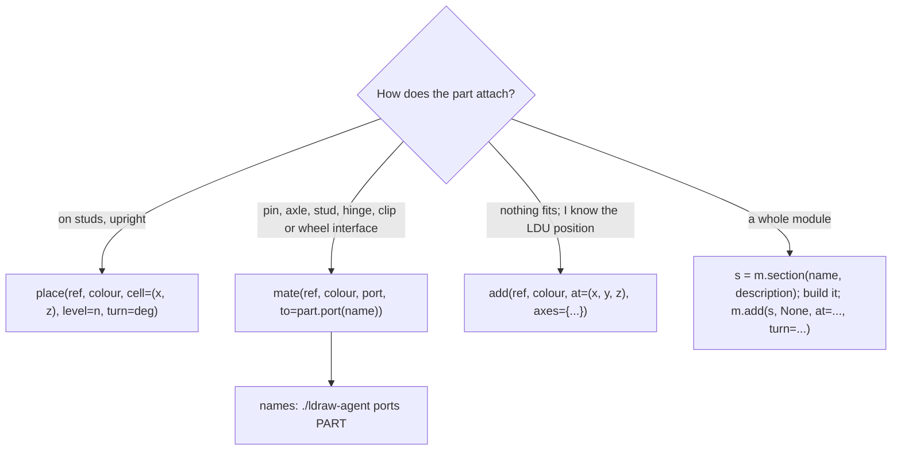

# Construction kit

Write a Python generator with `ldraw_tools.kit`. You choose parts and connections, and the kit computes positions and rotations. Every placement is checked against the parts already placed. A collision or a badly seated part raises `KitError` at the line that caused it, naming the ids and suggesting a fix. `save()` writes the MPD and an equivalent JSON plan, then prints the `check` verdict.

```python
from ldraw_tools.kit import Model

m = Model("pier", "A small pier with a Technic crane arm")            # main FILE block
post = m.place("3005", "Dark_Bluish_Grey", cell=(0, 0), level=0)     # 1x1 brick on the ground
deck = m.place("3034", "Reddish_Brown", cell=(0, 0), level=post.top, turn=90)       # 2x8 plate along Z on it
mount = m.place("32000", "Light_Bluish_Grey", cell=(0, 6), level=deck.top, turn=90)  # Technic brick 1x2
pin = m.mate("2780", "Black", "pin[0]", to=mount.port("pin_hole[0]"))                # pin into its hole
arm = m.mate("32524", "Red", "pin_hole[0]", to=pin.port("pin[2]"), roll=135)         # Beam 7, raised 45°
m.save("output/pier/pier.mpd")                                       # MPD + .plan.json + check verdict
```

## Choose the verb



| Verb or property | What it does |
|---|---|
| `place(ref, colour, cell=(x, z), level=n, turn=0)` | `cell` is the stud cell of the footprint's minimum corner (one stud = 20 LDU). `level` is the part's bottom in plates above the ground (one plate = 8 LDU; a brick = 3 plates). `turn` is 0, 90, 180 or 270 about the vertical. |
| `part.top`, `part.bottom` | The level of a placed part's top and bottom. Stack the next part with `level=below.top`. |
| `mate(ref, colour, port, to=other.port(name), roll=0, slide=0, flip=None)` | Puts the new part's `port` on the target port: studs seat at the socket mouth, other ports centre on each other. `roll` turns it about the shared axis; `slide` moves it along the axis (LDU); `flip=True` turns it end for end. |
| `add(ref, colour, at=(x, y, z), turn=0, axes={"y": "X", "z": "-Z"})` | Explicit LDU position. `axes` says where two local axes point (`X`, `-X`, `Y`/`DOWN`, `-Y`/`UP`, `Z`, `-Z`). |
| `wall(colour, start=(x, z), length=n, courses=k, level=l, along="X")` | A straight running-bond wall of 1xN bricks; joints are staggered so the courses lock together. Its top is at `l + 3k`. |
| `fill(colour, cell=(x, z), size=(w, d), level=l, part="plate")` | Covers a rectangle with the largest 2xN (then 1xN) plates or tiles. Plates side by side are not joined: bridge each seam or use one large plate. |
| `section(name, description)` | A submodel with the same verbs; place it with `add(section, None, at=..., turn=...)`. Collision and seating checks run within each section as you build; `save` checks the whole model. |
| Options on any verb | `id="roof-left"` (unique; used in every report), `purpose="..."`, `free="reason"` (an intentionally separate object), `overlap="reason"` (a deliberate overlap, reviewed instead of failing). |
| `next_step()` | Later placements go into a new building step. |

Colours are LDConfig names (`"Light_Bluish_Grey"`, `"Tan"`) or codes. `./ldraw-agent colours NAME` lists them.

## Conventions

| Quantity | Value |
|---|---|
| Axes | X right, Y **down** (negative Y is up), Z toward the viewer |
| Stud pitch | 20 LDU; `cell=(x, z)` puts a stud centre at (20x, 20z) |
| Plate, brick body height | 8 and 24 LDU, so a brick is 3 levels |
| Ports | Port names come from `ports PART`, ordered by kind and then by position; they don't depend on the part's colour |

## When the kit says no

| `KitError` says | Usual fix |
|---|---|
| `sunk N LDU on the stud of 'x' ... level=L` | Use the suggested level (often `x.top`). |
| `collides with 'x' ... spans levels a..b` | Move to another cell, or stack above `b`. |
| `has no port 'name'; it has: ...` | Pick a listed port; `ports PART` shows their positions and axes. |
| Both directions fail in `mate` | The target is blocked; try `roll`, `slide` or another port. |

After `save`, fix anything `check` reports. Typical misses are floating groups (two plates side by side need a part across the seam) and modules that are placed but not attached. Use `check --graph` to see which modules connect.
