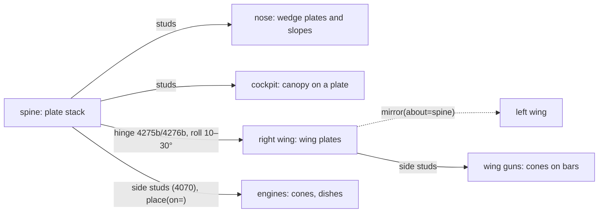

# Spaceships

Build a ship from **plates**, shaped with wedges and slopes, with many parts mounted **sideways** or **hinged at an angle**. Upright bricks make a building with wings. Start from a [spaceship recipe](../reference/README.md) and build with the [kit](kit.md).

## What official ships are made of

Share of parts in 53 official LEGO ships (Classic Space to UCS), against a generated ship that looked like a building:

| | Official ships: median (middle half) | Building-like ship |
|---|---|---|
| Plain bricks | 3% (0–7%) | 35% |
| Mounted sideways or upside down | 45% (20–57%) | 0% |
| At non-right angles (hinges) | 20% (0–49%) | 0% |
| Hinges, clips and bars | 12% (6–17%) | 0% |
| Wedge plates | 5% (2–7%) | 0% |
| Height ÷ length | 0.39 (0.32–0.51) | 0.26 |

`./ldraw-agent check MODEL.mpd --family spaceship` prints your model's shares and says when it reads as a building. `Model(..., family="spaceship")` adds the same advice to every `save()`.

## If it looks wrong

| It looks like | Because | Do instead |
|---|---|---|
| A building with wings | Hull walls of stacked bricks | Plate stacks; slopes and wedges shape the top and nose |
| A slab | Rectangular outline in the top view | Wedge plates taper the nose and wings; `mirror()` builds the other side |
| A toy | Engines and guns as upright bricks | Round parts on side studs: `place(..., on=lamp.port("stud[0]"))` |
| Flat | Wings in the hull's plane | Hinge the wing root: `mate(..., "hinge[0]", roll=20)` |
| Busy | The same detail everywhere | Quiet tiled hull, two or three detail clusters (grilles, cheese slopes) |

## Parts by role

| Role | Parts |
|---|---|
| Hull, spine | Plates 3020, 3022, 3034, 3832; tiles 3068b, 3069b on top |
| Nose and taper | Wing plates 41769/41770, 43722/43723 (left/right pairs), 51739; slopes 3039, 3040b; cheese slope 54200; curved 15068, 11477 |
| Wing roots | Hinge plates 4275b + 4276b (fingers), 2429 + 2430 (swivel), 44301a + 44302a (click) |
| Sideways mounts | Headlight brick 4070, side-stud brick 87087, brackets 99780/99781 |
| Engines, guns, lights | Cones 4589, dishes 4740, round plates 6141 and 4032a, round brick 3062b, grille tile 2412b |
| Cockpit | Canopies 47844 (3 wide), 4474 and 41883 (4 wide) |
| Underside | Inverted slopes 3665a, 4287a |

## How a starfighter connects

## Build order

## Review

- **Top view:** a tapered outline (nose, wing sweep), not a rectangle.
- **Right view:** thin; height about a third of the length.
- **Back view:** the engines read as engines.
- **`check --family spaceship`:** the style line shows no "reads as a building".

The [spaceship atlas](../../examples/spaceship-atlas/README.md) holds studies of large official ships (B-wing, X-wing, Y-wing). Use them for proportion and detail ideas, not as starting points.
