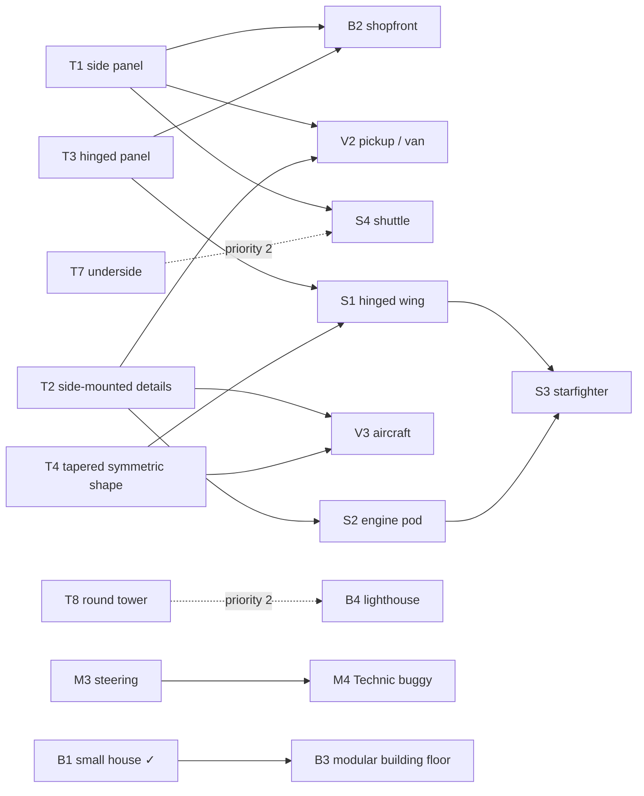

# Recipe roadmap

What recipes `docs/reference/` needs: which kinds and why, not just how many. It is based on what users ask for (transcripts, the [benchmark](../dev/benchmark.md)), the [archived examples](../../examples/archive/README.md) that need replacing, and how official LEGO models in each family are built.

## Two kinds of page

- **Technique pages** (10–40 parts) teach one joint or shaping method that every family reuses, such as a hinged panel or a sideways tile face.
- **Archetype pages** (40–150 parts) are small whole models of one family that combine techniques, such as a starfighter or a pickup.

Agents combine them: an archetype shows the model, and its techniques link to the pages that explain each joint.

## Why techniques first: construction signatures

Share of parts in official models (`data/models-annotated`), with the medians per family. "Sideways" means mounted on its side or upside down; "angled" means at a non-right angle (hinges, turntables).

| Family (official) | Plain bricks | Plates | Sideways | Angled | Hinges, clips, bars | Wedge plates | Tiles |
|---|---:|---:|---:|---:|---:|---:|---:|
| Buildings (60) | 12% | 21% | 17% | 8% | 3% | 0% | 12% |
| Cars and trucks (52) | 12% | 24% | 11% | 2% | 6% | 0% | 8% |
| Aircraft (47) | 5% | 24% | 13% | 10% | 4% | 3% | 7% |
| Boats (52) | 8% | 17% | 14% | 14% | 4% | 0% | 3% |
| Spaceships (53) | 3% | 26% | 45% | 20% | 12% | 5% | 8% |
| Technic (60) | 0% | 1% | 62% | 33% | 0% | 0% | 0% |

Today's recipes, measured the same way:

| Recipe | Parts | Plain bricks | Sideways | Angled | Hinges, clips | Wedges |
|---|---:|---:|---:|---:|---:|---:|
| small-house | 74 | 73% | 0% | 0% | 0% | 0% |
| small-car | 20 | 0% | 0% | 0% | 0% | 0% |
| starfighter | 12 | 0% | 33% | 0% | 0% | 17% |
| technic-frame | 8 | 0% | 50% | 0% | 0% | 0% |
| gear-train | 7 | 0% | 86% | 0% | 0% | 0% |

Every non-Technic family builds a sixth to a half of its parts sideways or at an angle. Today's recipes teach only upright stacking, so agents build everything like a building. A generated spaceship (aurora-lance) measured 35% plain bricks and 0% sideways. The technique pages below close that gap first.

## How the pages depend on each other (priority 1)

## The list

Status: ✓ exists, P1–P3 are priorities. S3 and S4 are the designs the user picked from rendered candidates (2026-10-09). "Needs" names the kit or `check` work a page depends on.

### Techniques (all families)

| # | Recipe | Teaches (key parts) | Needs | P |
|---|---|---|---|---|
| T1 | side panel | Brackets plus tiles for smooth vertical faces (99780/99781, 3069b) | `place(on=)` | 1 |
| T2 | side-mounted details | Round parts on side studs: lights, engines, guns (4070, 87087, 6141, 4589, 4740) | `place(on=)` | 1 |
| T3 | hinged panel | Finger and swivel hinges at an angle (4275b/4276b, 2429/2430) | hinge calibration | 1 |
| T4 | tapered symmetric shape | Left/right wedge plates and slopes (41769/41770, 43722/43723) | `mirror` | 1 |
| T5 | clip and bar | Rails, ladders, handles, greebles (4085, bars) | clip calibration | 2 |
| T6 | curved shell | Curved slopes for bodies and cockpits (15068, 11477, 93606) | — | 2 |
| T7 | underside | Inverted slopes for hulls and overhangs (3665, 3660, 4287) | port cleanup | 2 |
| T8 | round tower | Round bricks and plates, turntable (3941, 6143, 4032) | — | 1 |
| T9 | smooth finish | Tiles over plates, studless tops | — | 2 |
| T10 | tree and garden | Round trunk, rotated foliage, hedge, fence | — | 2 |
| T11 | minifig interior | Table, chairs, counter, stairs | — | 3 |

### Buildings

| # | Recipe | Teaches | Replaces / serves | P |
|---|---|---|---|---|
| B1 | small house ✓ | Walls with openings, hinged door, closed gable roof | cottage | ✓ |
| B2 | shopfront | Bracket facade, display window, hinged awning, sign | copper-bean; benchmark B2 | 1 |
| B3 | modular building floor | Stacked floors bridged, stairs, pins to the neighbour | Copper Lane, school, clinic | 1 |
| B4 | lighthouse / tower | Round tower, gallery railing, lamp room | lighthouse, wizard tower | 2 |
| B5 | hip roof and dormer | Corner slopes, dormer | dormer roof, winter lodge | 2 |
| B6 | porch and canopy | Posts with a bridged roof | porch, railway canopy | 2 |
| B7 | civic portico | Columns, arches, pediment, steps | museum, station, sanctuary | 2 |
| B8 | garage | Wide lintel, roller door | fire station, workshop | 3 |
| B9 | glasshouse | Glass panels in frames, glass roof | conservatory | 3 |
| B10 | castle wall | Battlements, arrow slits | — | 3 |

### Vehicles

| # | Recipe | Teaches | Replaces / serves | P |
|---|---|---|---|---|
| V1 | small car ✓ | Wheel holders, rims and tyres by `mate`, arches clearing tyres | — | ✓ |
| V2 | pickup / van | Cab, bracket doors, cargo bed, mudguards clearing tyres | pickup, van, tipper; benchmark V1 | 1 |
| V3 | aircraft | Fuselage, mirrored wedge wings, tail fin, side engines, landing gear | courier jet; An-225 prompt | 1 |
| V4 | sports car | Low curved body, wedge front, spoiler | grand tourer | 2 |
| V5 | boat | Hull from bow parts and inverted slopes, cabin | — | 2 |
| V6 | train | Bogies, couplings, cab | — | 3 |

### Spaceships

| # | Recipe | Teaches | Replaces / serves | P |
|---|---|---|---|---|
| S1 | hinged wing | Tapered wing on an angled hinge root, mirrored | — | ✓ |
| S2 | engine pod | Engines, exhausts and guns on side studs | — | ✓ |
| S3 | starfighter | Plate spine, wedge nose, hinged wings, side engines, canopy | today's starfighter; benchmark S1 | ✓ |
| S4 | shuttle | Wide plate hull, bracket side panels, rear engine block, landing legs | — | ✓ |
| S5 | freighter | Offset cockpit, cargo bay, clip greeble trench | — | 2 |
| S6 | micro capital ship | Layered wedge hull, superstructure, engine cluster | — | 2 |

### Technic and mechanisms

| # | Recipe | Teaches | Replaces / serves | P |
|---|---|---|---|---|
| M1 | Technic frame ✓ | Pinned beams, `along=`, `pin(between=)` | — | ✓ |
| M2 | gear train ✓ | Axles as bearings, gear spacing | — | ✓ |
| M3 | steering | Rack and pinion, knuckles, tie rods | benchmark T1 | 1 |
| M4 | Technic buggy | Frame, steering, suspension, wheels, seat | crawler and buggy prompts | 1 |
| M5 | suspension | Shocks, wishbones | independent suspension | 2 |
| M6 | crane | Turntable, pinned boom, winch, outriggers | atlas crane | 2 |
| M7 | crank and pistons | Crankshaft, rods, pistons | benchmark M1 | 2 |

### Scenes and landmarks

| # | Recipe | Teaches | Replaces / serves | P |
|---|---|---|---|---|
| L1 | scene layout | Joined baseplates, paths, props declared `free=` | stadium, gardens | 3 |
| L2 | gothic arches | Arches, rose window | cathedral | 3 |

## Acceptance for every page

- `check` PASS, run in CI by `tests/test_recipes.py`.
- One Mermaid connection diagram whose edges say how parts join.
- Kit verbs only, no pasted coordinates; page ≤ 5 KB ([curation guide](../reference/curation.md)).
- Preview opened and reviewed.
- Archetypes: the user picks the design from rendered candidates before it becomes a page.
- Spaceship and aircraft archetypes: plain bricks and sideways share inside the family's interquartile range (`check --family`).

## Order of work

1. **Done:** S1–S4, with the `check` calibration on official ships and the kit verbs (`place(on=)`, `hinge`, `mirror`) they need.
2. **Next:** the remaining priority-1 pages, family by family. Before each family:
   - run the official-model corpus check for it and fix the `check` gaps it shows, as was done for ships;
   - then write the technique pages;
   - then the archetypes.
3. **Then** priority 2 and 3, and new pages curated from user-selected successes.
