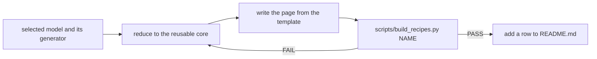

# Curating a recipe

Use this when the user selects a finished model as good. The result is one new recipe page that later agents can copy. Selection shows the model is useful, but the page must still pass the checks.



## Reduce it

Keep the construction that teaches something: a roof shape, a wheel package, a mechanism, a wing joint. Cut decoration and repetition until the generator is 20 to 60 lines. Keep real part numbers and the plan ids that make the code readable. Never paste generated coordinates: the page must use `place`, `mate`, `wall`, `fill` and `pin` so that it adapts.

## Write the page

Follow the existing recipes:

1. Title and one sentence: what it is, and **Use for:** which subjects.
2. The image line ``. `build_recipes.py` renders exactly the views named there.
3. A Mermaid connection flowchart. Nodes are plan ids or groups of them. Each edge label says how they join: `studs`, `2780 pin, hole 0`, `hinge`, `axle hole`, `side studs (SNOT)`. Dashed edges (`-.->`) mark anything assumed, not joined.
4. One `python` block that ends with `m.save("output/NAME/NAME.mpd")`.
5. A table of the changes a later agent will want (size, parts, orientation), and **Watch out** bullets for the mistakes the kit caught while you built it.

Use a state diagram only for real states (a door open and closed, a selector) and a sequence diagram only for an order of events. Use tables for numbers. Keep the page under 5 KB.

## Check and publish

```sh
.venv/bin/python scripts/build_recipes.py NAME     # must PASS; refreshes img/NAME.png
.venv/bin/python scripts/check_mermaid.py docs/reference/NAME.md
.venv/bin/python -m pytest -q tests/test_recipes.py
```

Open the new image and confirm it shows what the page says. Add a row to the [recipe catalog](README.md). If you learned a rule that applies beyond this recipe, add one line to [lessons](lessons.md).
