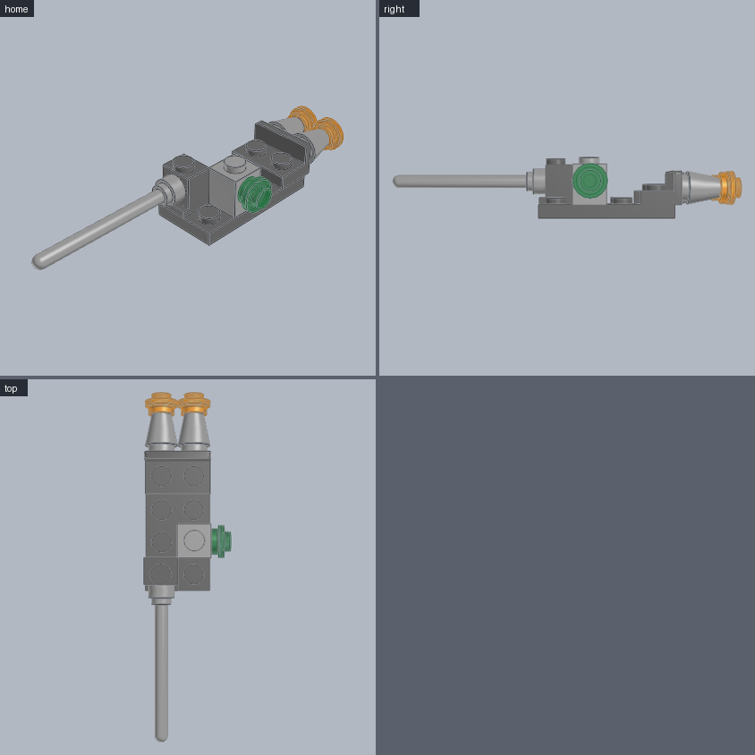
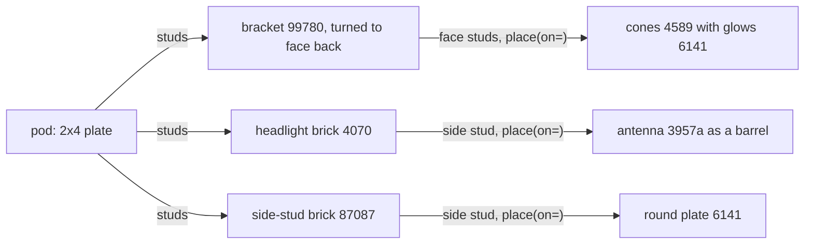

# Engine pod

Engines, a gun barrel and a light mounted sideways on a small pod. **Use for:** spaceship engines and guns, car and truck lights, any round detail that faces forward, back or sideways.





```python
from ldraw_tools.kit import Model

m = Model("engine-pod", "Engines, a gun and a light mounted sideways on a small pod", family="spaceship")
pod = m.place("3020", "Dark_Bluish_Grey", cell=(0, 0), level=0, turn=90, id="pod")             # 2x4 along Z
mount = m.place("99780", "Dark_Bluish_Grey", cell=(0, 3), level=pod.top, turn=180, id="engine-mount")
for k, stud in enumerate(("stud[0]", "stud[1]")):                                             # the bracket's face studs
    cone = m.place("4589", "Light_Bluish_Grey", on=mount.port(stud), id=f"engine-{k}")       # nozzle points back
    m.place("6141", "Trans_Orange", on=cone.port("stud[0]"), id=f"glow-{k}")
lamp = m.place("4070", "Dark_Bluish_Grey", cell=(0, 0), level=pod.top, id="gun-mount")        # side stud faces forward
m.place("3957a", "Light_Bluish_Grey", on=lamp.port("stud[0]"), id="gun")
light = m.place("87087", "Light_Bluish_Grey", cell=(1, 1), level=pod.top, turn=270, id="light-mount")
m.place("6141", "Trans_Green", on=light.port("stud[0]"), id="light")                           # faces +X
m.save("output/engine-pod/engine-pod.mpd")
```

| Mount | Side stud | Faces at `turn=0` |
|---|---|---|
| Headlight brick 4070 | `stud[0]` | front (-Z) |
| Side-stud brick 87087 | `stud[0]` | front (-Z) |
| Bracket 99780 (1x2 face) | `stud[0]`, `stud[1]` | front (-Z) |

`turn=90` faces left (-X), `turn=180` back (+Z), `turn=270` right (+X).

**Watch out**
- On a side face, cell (0, 0) is the stud you name and cell z points up.
- Cones 4589 and dishes 4740 take a stud in their round hole; a round plate 6141 caps a cone's tip stud.
- `on=` needs a stud. Bars and clips join with `mate()`.
