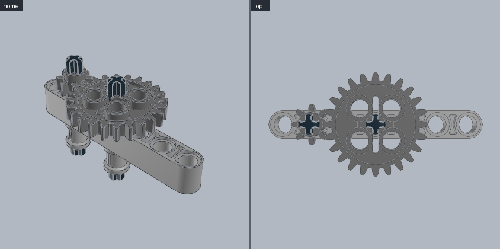
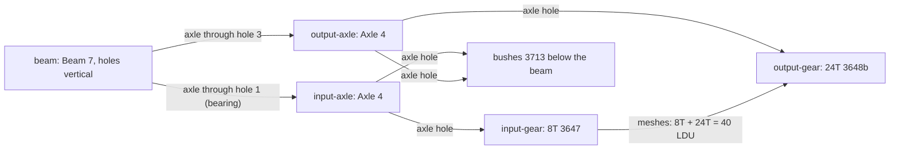

# Gear train

Two axles through a beam, with an 8-tooth gear driving a 24-tooth gear (3:1 reduction) and bushes holding the axles. **Use for:** winches, turntables, cranes, any drive.





```python
from ldraw_tools.kit import Model

m = Model("gear-train", "Two axles in a beam: an 8-tooth gear drives a 24-tooth gear (3:1 reduction)")
beam = m.add("32524", "Light_Bluish_Grey", at=(0, 0, 0), axes={"y": "Y", "z": "X"}, id="beam")   # holes vertical
for name, hole, gear in (("input", 1, "3647"), ("output", 3, "3648b")):     # holes 40 LDU apart = 8T + 24T
    axle = m.mate("3705", "Black", "axle[0]", to=beam.port(f"pin_hole[{hole}]"), id=f"{name}-axle")
    m.mate(gear, "Dark_Bluish_Grey", "axle_hole[0]", to=axle.port("axle[0]"), slide=20, toward="UP", id=f"{name}-gear")
    m.mate("3713", "Light_Bluish_Grey", "axle_hole[0]", to=axle.port("axle[0]"), slide=20, toward="DOWN", id=f"{name}-bush")
m.save("output/gear-train/gear-train.mpd")
```

| Gear pair (common Technic gears) | Centre distance | Holes apart in a beam |
|---|---:|---:|
| 8T + 8T (3647) | 20 LDU | 1 |
| 8T + 24T (3647 + 3648b) | 40 LDU | 2 |
| 16T + 16T (4019 / 94925) | 40 LDU | 2 |
| 24T + 24T (3648b) | 60 LDU | 3 |
| 8T + 40T (3649) | 60 LDU | 3 |

Rule: centre distance = (teeth₁ + teeth₂) × 1.25 LDU. Spur gears in a straight beam need that to be a multiple of 20.

**Watch out**
- An axle through a round pin hole is a bearing (it turns); through an axle hole it is locked. Gears must sit on axles, not on pins.
- `slide=20, toward="UP"` puts the gear just above the 20 LDU thick beam. The checker treats meshing teeth as "review", not a collision.
- Keep each axle retained at both ends (bush, gear or beam) so it cannot slide out.
