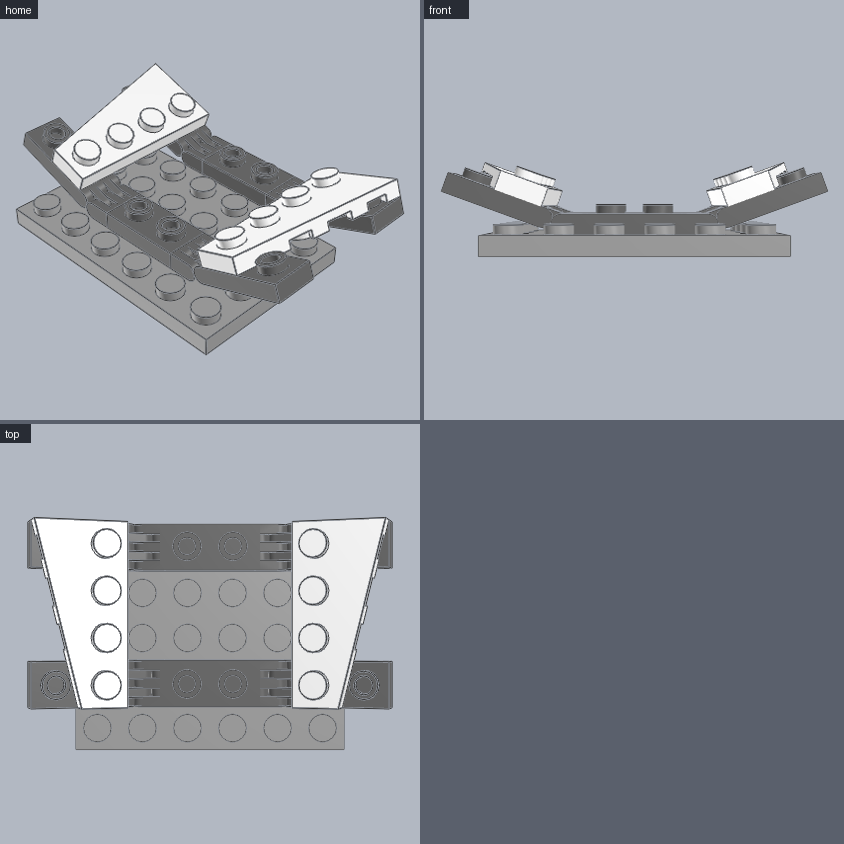

# Hinged wing

A wing plate raised on two hinge pairs, then mirrored to the other side. **Use for:** starfighter and aircraft wings with dihedral, folding fins, ramps and lifted panels.




```python
from ldraw_tools.kit import Model

m = Model("hinged-wing", "A wing raised on two hinge pairs, mirrored to the other side", family="spaceship")
hull = m.place("3032", "Light_Bluish_Grey", cell=(0, 0), level=0, id="hull")         # 4x6 plate: cells x 0..3, z 0..5
side = []
for z in (1, 4):                                                                      # two pairs on one pivot line
    root = m.place("4275b", "Dark_Bluish_Grey", cell=(2, z), level=hull.top, id=f"root-right-{z}")
    side += [root, m.hinge("4276b", "Dark_Bluish_Grey", "hinge[0]", to=root.port("hinge[0]"), angle=20,
                           id=f"flap-right-{z}")]
side.append(m.place("41770", "White", on=side[1].port("stud[2]"), id="wing-right"))  # rests on both flaps
m.mirror(side, about=hull)                                                            # left side: 41769, mirrored hinges
m.save("output/hinged-wing/hinged-wing.mpd")
```

| Change | How |
|---|---|
| Wing angle | `angle=` on every `hinge()` of that wing: 0 flat, positive up, negative down |
| Bigger wing | A longer wing plate on the flaps' inner studs: 54383/54384 (3x6), 3933/3934 (4x8). Keep two hinge pairs under it |
| Taper direction | 41770 (Left) on the right side puts the taper outward and forward; `mirror()` swaps it to 41769 |
| Swing sideways | Swivel hinge plates 2429 + 2430 instead of 4275b + 4276b |

**Watch out**
- Every hinge pair under one wing needs the same `angle`, or the wing plate cannot sit on all the flaps.
- `stud[2]` is the flap's inner top stud; `stud[1]` is the hollow stud underneath. Check with `./ldraw-agent ports 4276b`.
- Parts that ride on a hinged flap go on with `place(..., on=flap.port(...))`. `place(cell=...)` only knows the ground grid.
