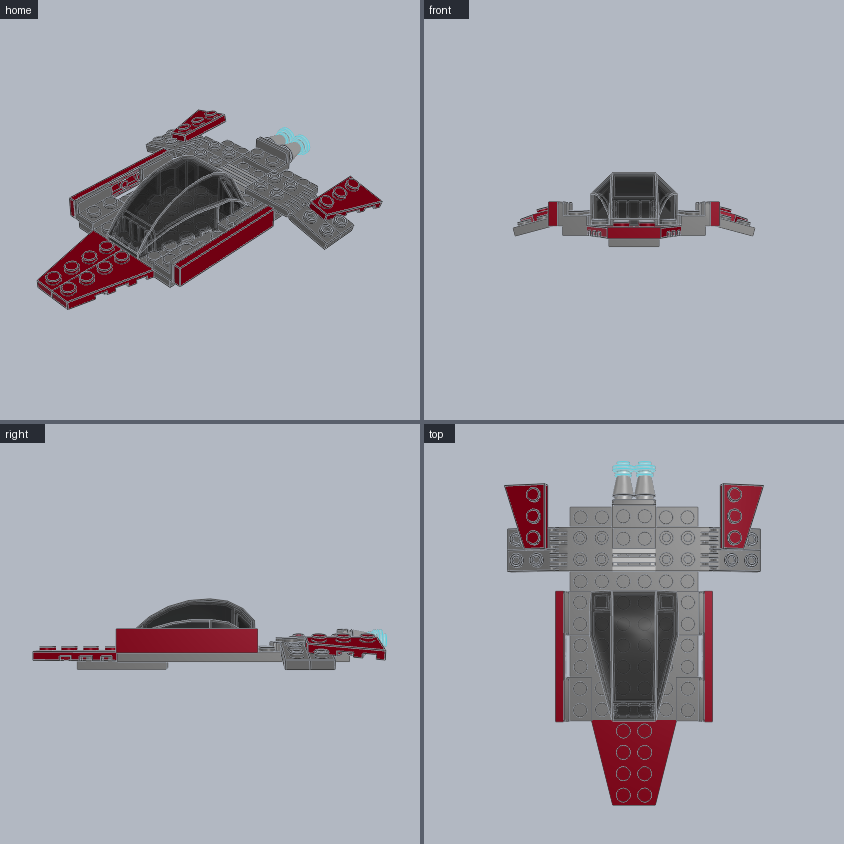
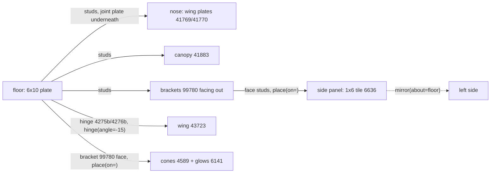

# Shuttle

A small shuttle with smooth sides: tiles mounted on brackets instead of brick walls, a canopy cockpit, wings hinged down at the tail and rear engines. **Use for:** shuttles, freighters, transports, dropships.





```python
from ldraw_tools.kit import Model

m = Model("shuttle", "A small shuttle: canopy cockpit, smooth bracket-and-tile sides, wings hinged down, rear engines",
          family="spaceship")
floor = m.place("3033", "Dark_Bluish_Grey", cell=(0, 0), level=0, turn=90, id="floor")         # 6x10: x 0..5, z 0..9
nose = m.place("41770", "Dark_Red", cell=(3, -4), level=0, id="nose-right")
m.mirror([nose], about=floor)
m.place("3020", "Dark_Bluish_Grey", cell=(2, -2), level=-1, turn=90, id="nose-joint")         # under nose and floor
m.place("41883", "Trans_Black", cell=(1, 0), level=1, id="canopy")
side = [m.place("99780", "Dark_Bluish_Grey", cell=(5, z), level=1, turn=270, id=f"side-right-{z}") for z in (0, 4)]
side.append(m.place("6636", "Dark_Red", on=side[0].port("stud[0]"), id="panel-right"))        # 1x6 tile on both faces
for z in (7, 8):
    root = m.place("4275b", "Dark_Bluish_Grey", cell=(4, z), level=1, id=f"root-right-{z}")
    side += [root, m.hinge("4276b", "Dark_Bluish_Grey", "hinge[0]", to=root.port("hinge[0]"), angle=-15,
                           id=f"flap-right-{z}")]
side.append(m.place("43723", "Dark_Red", on=side[-1].port("stud[2]"), id="wing-right"))
m.mirror(side, about=floor)
engine = m.place("99780", "Dark_Bluish_Grey", cell=(2, 9), level=1, turn=180, id="engines")   # centre line: not mirrored
for k, stud in enumerate(("stud[0]", "stud[1]")):
    cone = m.place("4589", "Light_Bluish_Grey", on=engine.port(stud), id=f"engine-{k}")
    m.place("6141", "Trans_Light_Blue", on=cone.port("stud[0]"), id=f"glow-{k}")
m.place("2412b", "Light_Bluish_Grey", cell=(2, 7), level=1, id="vent")
m.save("output/shuttle/shuttle.mpd")
```

| Change | How |
|---|---|
| Longer sides | A 1x8 tile (4162) across three brackets |
| Wings up | `angle=15` on both hinges |
| Bigger wings | 54383/54384 (3x6) on the flaps |
| Windscreen cockpit | A 2x4x2 windscreen 3823 at the front instead of the canopy |

**Watch out**
- A side tile must cover face studs on both brackets. On one bracket it can only hold by one or two studs.
- Centre-line parts (canopy, engines, vent) go after `mirror()` and outside the mirrored list.
- The nose joins the floor through the plate underneath at `level=-1`. Two plates side by side need a part across the seam.
