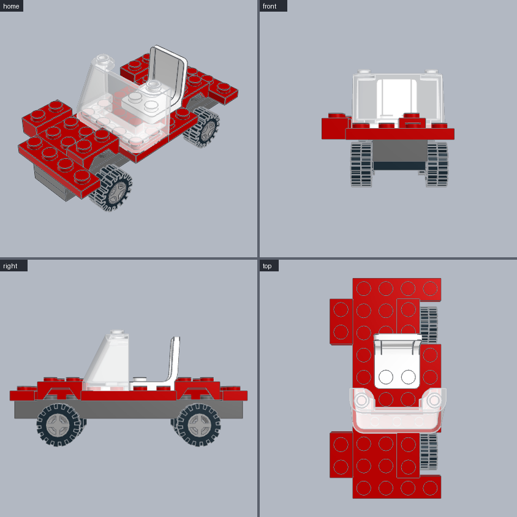
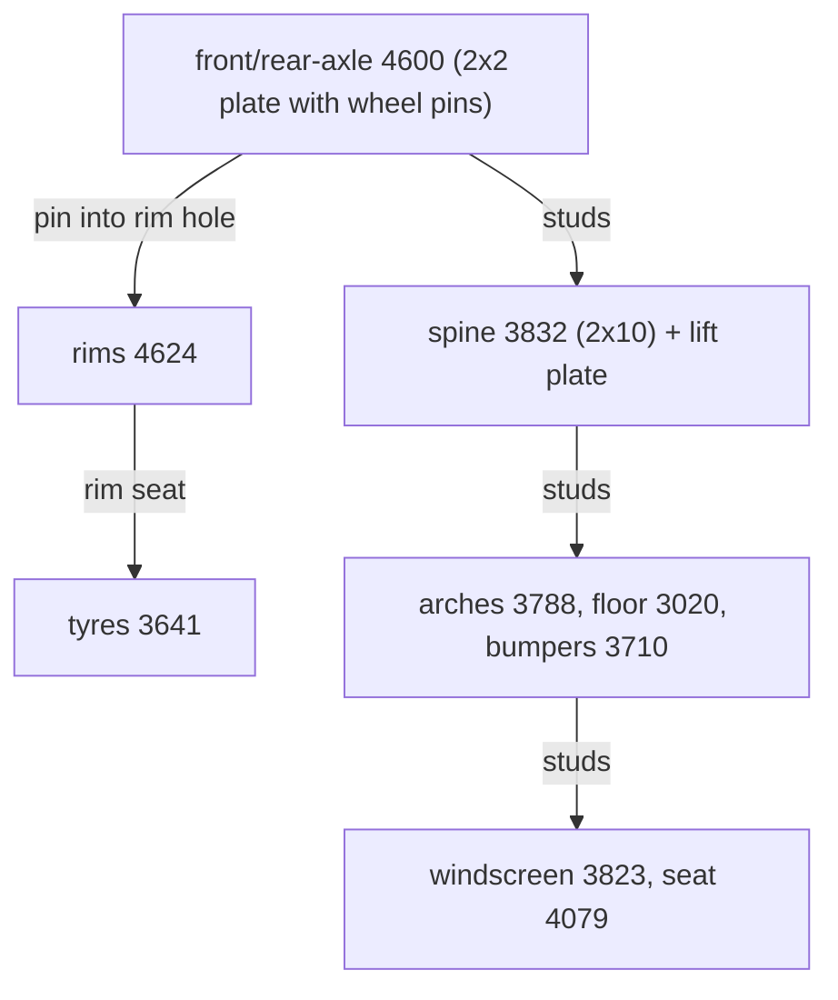

# Small car

Two wheel axles under a 2-wide spine, wheel arches, floor, windscreen and seat. **Use for:** cars, vans, carts and anything on small wheels.





```python
from ldraw_tools.kit import Model

m = Model("small-car", "A small open car: 2-wide spine on two axles, wheel arches, windscreen and seat")
r = m.part("3641").hi[1]                    # tyre radius: its box is centred on the wheel axis
axles = (r - 3) / 8                         # 4600 pins sit 3 LDU above its bottom, so tyres touch y = 0
for name, z in (("front", 1), ("rear", 7)):
    holder = m.place("4600", "Black", cell=(1, z), level=axles, id=f"{name}-axle")
    for side, pin in (("left", "pin[0]"), ("right", "pin[1]")):
        rim = m.mate("4624", "Light_Bluish_Grey", "pin_hole[0]", to=holder.port(pin), id=f"{name}-{side}-rim")
        m.mate("3641", "Black", "tyre_bead[0]", to=rim.port("rim_seat[0]"), id=f"{name}-{side}-tyre")
spine = m.place("3832", "Dark_Bluish_Grey", cell=(1, 0), level=holder.top, turn=90, id="spine")   # 2x10 along Z
lift = m.place("3832", "Dark_Bluish_Grey", cell=(1, 0), level=spine.top, turn=90, id="lift")      # body clears tyres
body = lift.top
m.place("3710", "Red", cell=(0, 0), level=body, id="front-bumper")            # 1x4 plates
m.place("3788", "Red", cell=(0, 1), level=body, id="front-arch")              # mudguards over the wheels
floor = m.place("3020", "Red", cell=(0, 3), level=body, id="floor-front")     # 2x4 plates between the arches
m.place("3020", "Red", cell=(0, 5), level=body, id="floor-rear")
m.place("3788", "Red", cell=(0, 7), level=body, id="rear-arch")
m.place("3710", "Red", cell=(0, 9), level=body, id="rear-bumper")
m.place("3823", "Trans_Clear", cell=(0, 3), level=floor.top, id="windscreen")
m.place("4079", "White", cell=(1, 5), level=floor.top, id="seat")
m.save("output/small-car/small-car.mpd")
```

| Change | How |
|---|---|
| Wheelbase | Move the rear axle's `z` and the arches with it; use a longer spine (3460 1x8, 3832 2x10, 2445 2x12). |
| Bigger wheels | Other rims and tyres. Recompute `r`, and add lift plates until the arches clear the tyres (the kit reports `collides with ...-tyre`). |
| Closed cabin | Build walls on the floor with `wall()` and roof it with plates. |
| Front | The front is `-Z` (the windscreen faces it). The `front` view shows it; in the `top` view it is at the bottom. |

**Watch out**
- A 4-wide plate directly on the wheel holders hits the rims. Keep the spine 2 wide and raise the body by one plate.
- Mudguards one plate too low cut into the tyres. The kit rejects them, naming the tyre.
- For a ground line, `vehicle check MODEL.mpd` measures where the tyres touch `y = 0`.
