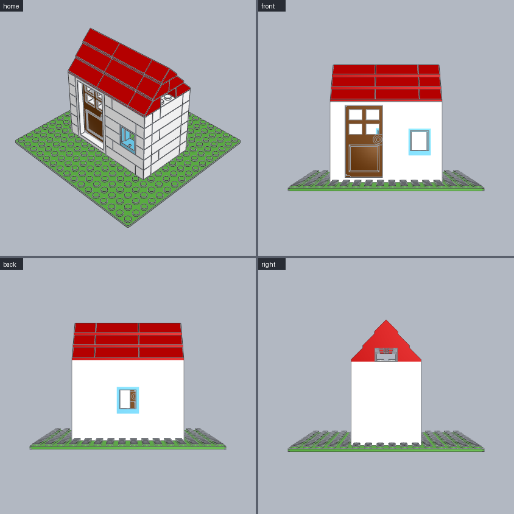
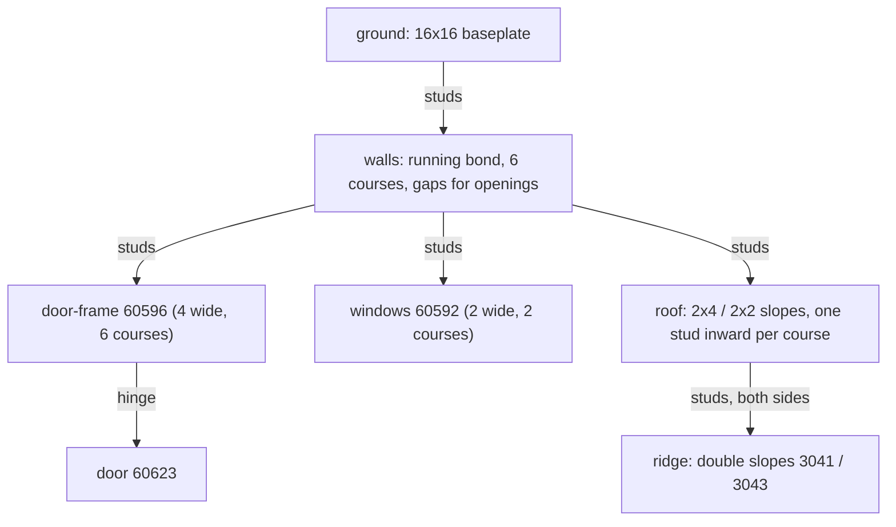

# Small house

Walls with a door and windows, a hinged door and a gable roof. **Use for:** houses, shops, stations, any walled building.





```python
from ldraw_tools.kit import Model

m = Model("small-house", "A small house: four walls with a door and windows, gable roof")
ground = m.place("3867", "Bright_Green", cell=(0, 0), level=0, id="ground")      # 16x16 baseplate
L = ground.top
W, D, x0, z0 = 10, 6, 3, 5                     # footprint 10x6 studs starting at cell (3, 5); D even
m.wall("White", start=(x0, z0), length=W, courses=6, level=L, along="X", prefix="front",
       openings=[(1, 4, 0, 5), (7, 2, 2, 3)])  # door gap 4 wide x 6 courses; window gap 2 wide x 2
m.wall("White", start=(x0, z0 + D - 1), length=W, courses=6, level=L, along="X", prefix="back",
       openings=[(4, 2, 2, 3)])
m.wall("White", start=(x0, z0 + 1), length=D - 2, courses=6, level=L, along="Z", prefix="left")
m.wall("White", start=(x0 + W - 1, z0 + 1), length=D - 2, courses=6, level=L, along="Z", prefix="right")
frame = m.place("60596", "White", cell=(x0 + 1, z0), level=L, id="door-frame")
m.mate("60623", "Reddish_Brown", "hinge[0]", to=frame.port("hinge[0]"), id="door")
m.place("60592", "Medium_Azure", cell=(x0 + 7, z0), level=L + 6, id="window-front")
m.place("60592", "Medium_Azure", cell=(x0 + 4, z0 + D - 1), level=L + 6, id="window-back")
top = L + 18                                   # 6 courses x 3 plates
for course in range(D // 2 - 1):               # each course steps one stud inward from front and back
    for x in (x0, x0 + 4):
        m.place("3037", "Red", cell=(x, z0 + course), level=top + 3 * course, id=f"roof-front-{course}-{x}")
        m.place("3037", "Red", cell=(x, z0 + D - 2 - course), level=top + 3 * course, turn=180,
                id=f"roof-back-{course}-{x}")
    m.place("3039", "Red", cell=(x0 + 8, z0 + course), level=top + 3 * course, id=f"roof-front-{course}-end")
    m.place("3039", "Red", cell=(x0 + 8, z0 + D - 2 - course), level=top + 3 * course, turn=180,
            id=f"roof-back-{course}-end")
for x in (x0, x0 + 4):                         # the ridge sits on both slope rows and joins the halves
    m.place("3041", "Red", cell=(x, z0 + D // 2 - 1), level=top + 3 * (D // 2 - 1), id=f"ridge-{x}")
m.place("3043", "Red", cell=(x0 + 8, z0 + D // 2 - 1), level=top + 3 * (D // 2 - 1), id="ridge-end")
m.save("output/small-house/small-house.mpd")
```

| Change | How |
|---|---|
| Size | `W` (any length the slopes cover: 4s and a 2), `D` (even). Keep the openings inside the wall. |
| Openings | `openings=[(offset, width, first_course, last_course)]`. Door frame 60596 needs 4 x 6 courses; window 60592 needs 2 x 2. |
| Taller house | More `courses`; then move `top` and the window levels by 3 per course. |
| Closed gables | Fill each gable end with 1xN bricks that shrink by two studs per course. |

**Watch out**
- Part sizes are not in their numbers. 60623 is a 4x6 door, so check `ports PART` (the body box) before cutting an opening.
- Slopes face `-Z` at `turn=0` and `+Z` at `turn=180`.
- Without the ridge, the front and back halves of the roof only touch and `check` reports them floating.
