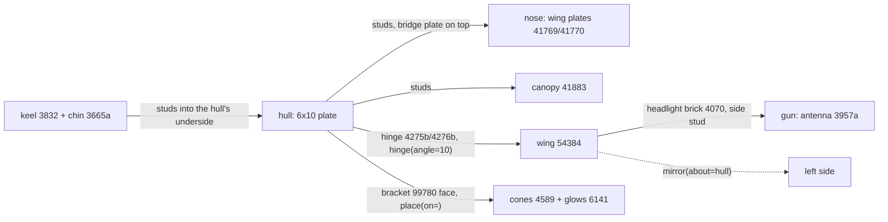

# Starfighter

A small starfighter: plate hull, wing-plate nose, canopy, swept wings on hinges, rear engines and wing-tip guns. **Use for:** fighters, interceptors, racers, anything long, low and winged.




```python
from ldraw_tools.kit import Model

m = Model("starfighter", "A small starfighter: plate hull, wedge nose, hinged swept wings, rear engines, wing-tip guns",
          family="spaceship")
hull = m.place("3033", "Light_Bluish_Grey", cell=(0, 4), level=0, turn=90, id="hull")      # 6x10: x 0..5, z 4..13
nose = m.place("41770", "Light_Bluish_Grey", cell=(3, 0), level=0, id="nose-right")       # taper outward and forward
m.mirror([nose], about=hull)
m.place("3022", "Light_Bluish_Grey", cell=(2, 3), level=1, id="nose-bridge")              # joins nose and hull
fairing = m.place("54200", "Light_Bluish_Grey", cell=(5, 4), level=1, turn=180, id="fairing-right")
m.mirror([fairing], about=hull)
m.place("41883", "Trans_Black", cell=(1, 5), level=1, id="canopy")                        # covers rows 5..10
m.place("3832", "Dark_Bluish_Grey", cell=(2, 4), level=-1, turn=90, id="keel")            # depth underneath
for x in (2, 3):
    m.place("3665a", "Dark_Bluish_Grey", cell=(x, 4), level=-4, id=f"chin-{x}")          # hangs from the keel
side = []
for z in (11, 12):
    root = m.place("4275b", "Dark_Bluish_Grey", cell=(4, z), level=1, id=f"root-right-{z}")
    side += [root, m.hinge("4276b", "Dark_Bluish_Grey", "hinge[0]", to=root.port("hinge[0]"), angle=10,
                           id=f"flap-right-{z}")]
wing = m.place("54384", "White", on=side[1].port("stud[2]"), id="wing-right")
lamp = m.place("4070", "Dark_Bluish_Grey", on=wing.port("stud[8]"), id="gun-mount-right")
side += [wing, lamp, m.place("3957a", "Light_Bluish_Grey", on=lamp.port("stud[0]"), id="gun-right")]
engine = m.place("99780", "Dark_Bluish_Grey", cell=(3, 13), level=1, turn=180, id="engine-mount-right")
for k, stud in enumerate(("stud[0]", "stud[1]")):
    cone = m.place("4589", "Dark_Bluish_Grey", on=engine.port(stud), id=f"engine-right-{k}")
    side += [cone, m.place("6141", "Trans_Orange", on=cone.port("stud[0]"), id=f"glow-right-{k}")]
side += [engine, m.place("2412b", "Dark_Bluish_Grey", cell=(3, 11), level=1, turn=90, id="vent-right")]
m.mirror(side, about=hull)                                                                # the whole left side
m.save("output/starfighter/starfighter.mpd")
```

| Change | How |
|---|---|
| Wing angle | `angle=` on both hinges: 0 flat, 10 a slight dihedral, negative tips down |
| Bigger wings | 3933/3934 (4x8) instead of 54384; keep both hinge pairs under the wing |
| More engines | Another bracket on row 13 or a dish 4740 nozzle; `mirror()` doubles them |
| Palette | Hull, nose and keel in one colour, wings in a second, one glow colour |

**Watch out**
- The canopy covers rows 5 to 10 on the four middle columns. Wing roots, vents and engines go behind it, on rows 11 to 13.
- Put only one side in `side`. A part on the centre line (keel, canopy, nose bridge) must not be mirrored.
- The inverted slopes 3665a hang from the keel by their own top studs: `level=-4` is a brick below the keel.
