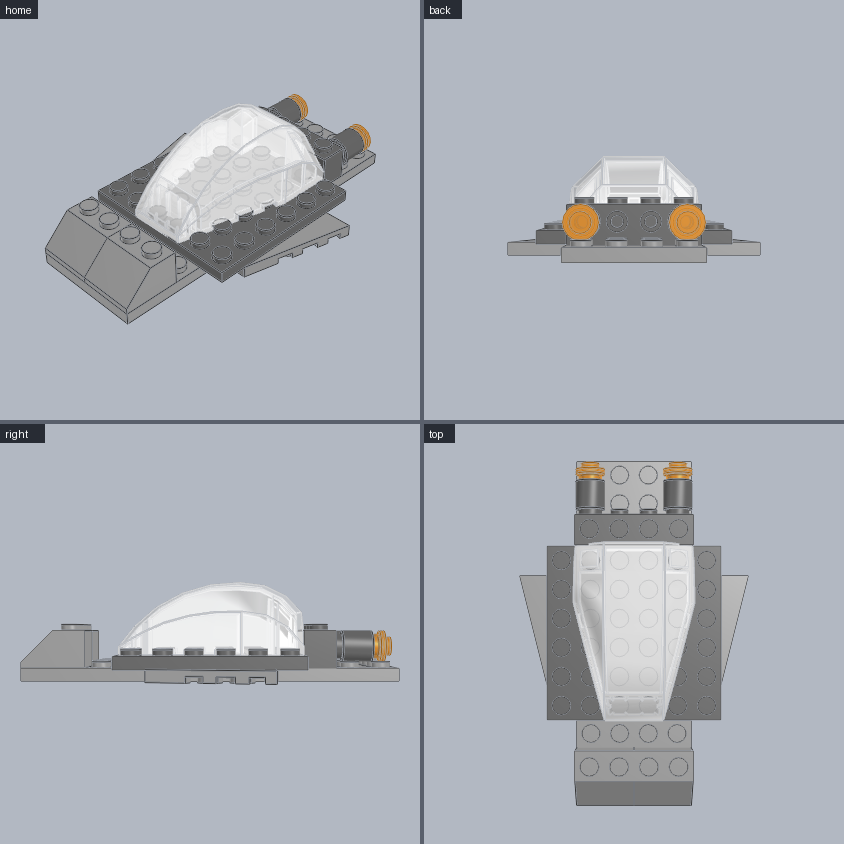
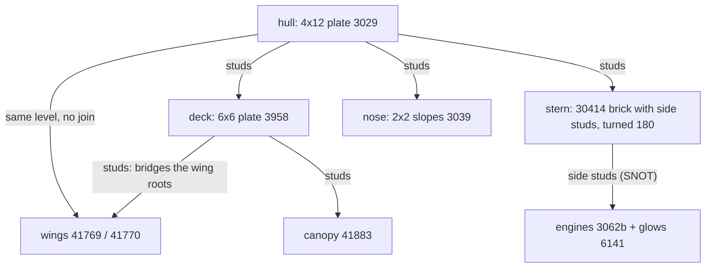

# Starfighter

A hull plate with wings bridged to it, a canopy, a sloped nose and engines on side studs (SNOT). **Use for:** spaceships, aircraft, anything with wings or parts facing sideways.





```python
from ldraw_tools.kit import Model

m = Model("starfighter", "A small starfighter: wings bridged to the hull, canopy, side-stud engines")
hull = m.place("3029", "Light_Bluish_Grey", cell=(2, 0), level=0, turn=90, id="hull")          # 4x12 plate along Z
m.place("41769", "Light_Bluish_Grey", cell=(0, 4), level=0, id="wing-left")                    # stud column inboard
m.place("41770", "Light_Bluish_Grey", cell=(6, 4), level=0, id="wing-right")
deck = m.place("3958", "Dark_Bluish_Grey", cell=(1, 3), level=hull.top, id="deck")              # 6x6 bridges both wing roots
m.place("41883", "Trans_Clear", cell=(2, 3), level=deck.top, id="canopy")                      # 4x6 curved canopy
stern = m.place("30414", "Dark_Bluish_Grey", cell=(2, 9), level=hull.top, turn=180, id="stern")  # side studs face +Z
for k, stud in enumerate(("stud[0]", "stud[3]")):
    nozzle = m.mate("3062b", "Dark_Bluish_Grey", "stud_receptacle[0]", to=stern.port(stud), id=f"engine-{k}")
    m.mate("6141", "Trans_Orange", "pin_hole[0]", to=nozzle.port("stud[0]"), id=f"glow-{k}")
m.place("3039", "Light_Bluish_Grey", cell=(2, 0), level=hull.top, id="nose-left")               # slopes face -Z
m.place("3039", "Light_Bluish_Grey", cell=(4, 0), level=hull.top, id="nose-right")
m.save("output/starfighter/starfighter.mpd")
```

| Technique | How |
|---|---|
| Wings | Wings beside the hull at the same level touch but are not joined. Cover their stud columns and the hull with one plate. A wing's stud column is shown by `ports 41769`. Put that column inboard. |
| SNOT (studs not on top) | Bricks with side studs (30414, 87087) expose `stud[k]` ports that point sideways. `mate` anything with a socket onto them, and the part takes that direction. |
| Stacking on a mated part | Ports keep working: the glow plate mates to the engine brick's own stud. |
| Bigger ship | Repeat the bridge-plate pattern for each wing pair. Build modules (engines, cockpit) as sections. |

**Watch out**
- Check where side studs point: 30414 at `turn=0` faces `-Z` (forward). `turn=180` makes the engines face backward.
- A 1x1 round plate's socket is `pin_hole[0]`, not `stud_receptacle[0]`. The kit's error lists each part's port names.
- Large canopies cover 4x6 or more. Leave their whole footprint free on one level.
