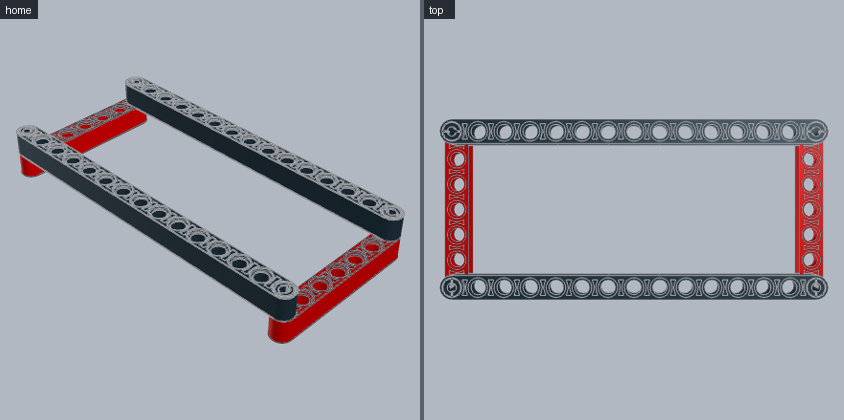
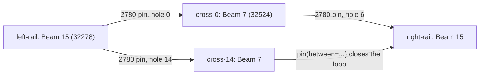

# Technic frame

A closed rectangle of beams pinned at the corners: the base of chassis, cranes and machines. **Use for:** any Technic structure.





```python
from ldraw_tools.kit import Model

m = Model("technic-frame", "A pinned rectangular Technic frame: two rails and two cross beams")
left = m.add("32278", "Black", at=(0, 0, 0), axes={"y": "Y", "z": "X"}, id="left-rail")   # Beam 15 along X
crosses = []
for k in (0, 14):                                   # a pin in each end hole, a cross beam on each pin
    pin = m.mate("2780", "Black", "pin[0]", to=left.port(f"pin_hole[{k}]"), id=f"pin-left-{k}")
    crosses.append(m.mate("32524", "Red", "pin_hole[0]", to=pin.port("pin[2]"), along="Z", id=f"cross-{k}"))
pin = m.mate("2780", "Black", "pin[0]", to=crosses[0].port("pin_hole[6]"), id="pin-right-0")
right = m.mate("32278", "Black", "pin_hole[0]", to=pin.port("pin[2]"), along="X", id="right-rail")
m.pin("Black", between=(right.port("pin_hole[14]"), crosses[1].port("pin_hole[6]")), id="pin-right-14")
m.save("output/technic-frame/technic-frame.mpd")
```

| Concept | Meaning |
|---|---|
| Beam ports | Beams have `pin_hole[0..n-1]` in order along the beam, 20 LDU apart, axes through the beam. `ports 32278` lists them. |
| `axes={"y": "Y", "z": "X"}` | Beam holes (local y) vertical, length (local z) along X: the beam lies flat. |
| Pin ports | `pin[0]` and `pin[2]` are the two halves of a 2780 pin; `pin[1]` is the whole pin. Put `pin[0]` in a hole and the next beam on `pin[2]`. |
| `along="Z"` | Points the new beam's length along world Z. Use it instead of `roll` in pin chains. |
| `pin(between=(a, b))` | Closes a loop: puts a pin through two holes on one axis, 20 LDU apart (40 for the long pins 6558/32556). |

**Watch out**
- Two beams side by side in the same layer are not joined. Every beam needs a pin or axle to a neighbour in another layer.
- `pin(between=...)` refuses holes that are not coaxial, which means the frame was laid out with the wrong beam length. Fix the layout rather than moving the pin.
- Add bracing (a diagonal or a second layer) for long frames. The checker proves the frame is connected, not that it is stiff.
