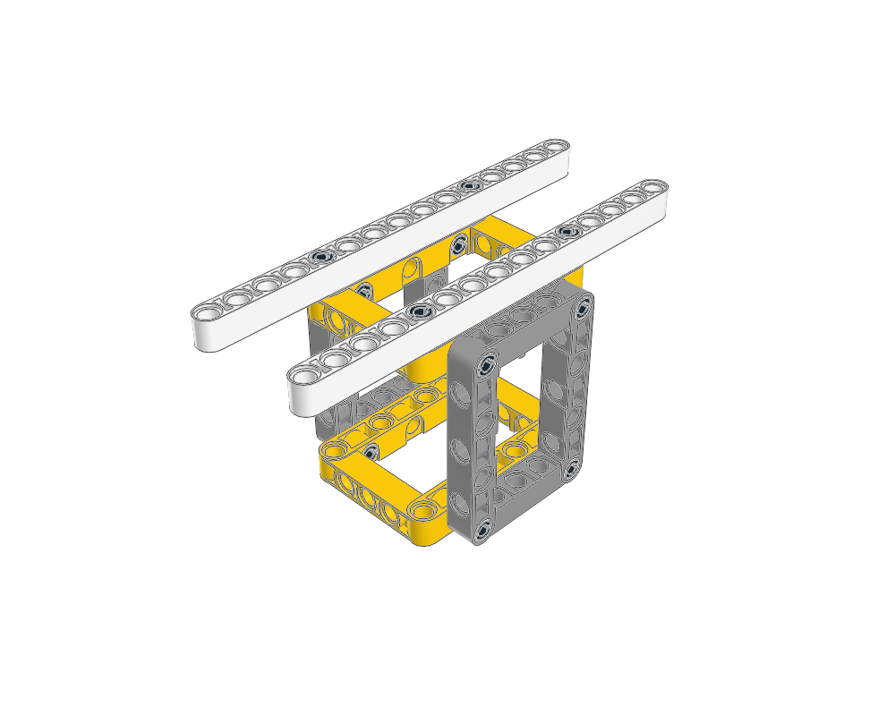
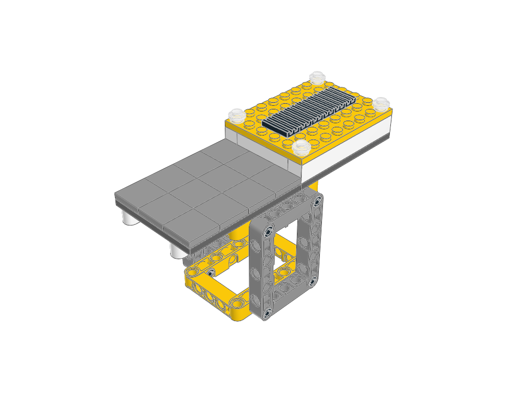

# Technic structural atlas

Four small constructions teach stage-1 structural building. Each includes an editable MPD, reproducible generator and plan, required-joint contract, geometry and structural checks, BOM comparison and seven views.

| Reinforced mounting frame | Box chassis |
| --- | --- |
| [](reinforced-frame/GUIDE.md) | [](box-chassis/GUIDE.md) |
| Two-point crossmembers on a moulded frame. | Perpendicular frames with long body rails. |

| Frame tower | Service platform |
| --- | --- |
| [](frame-tower/GUIDE.md) | [](service-platform/GUIDE.md) |
| Overlapping members join repeated box cells. | Eight stud-ended pins support a System deck and equipment body. |

Start with the [agent workflow](../../docs/agent/technic.md) and each model's `GUIDE.md`. [Visual review](visual-review.md) records what was actually inspected. These examples use conservative structural checks; physical strength and complete assembly access remain unproven. The [mechanism atlas](../mechanism-atlas/README.md) covers the now-authorized Stage 2 through source and build-page studies; analytical mechanism verification is deferred.

```sh
./ldraw-agent examples --family technic
.venv/bin/python examples/technic-atlas/generate.py --renders
.venv/bin/python examples/technic-atlas/generate.py --name frame-tower --levels 3 --renders
```

The per-model `generate.py` rebuilds its source and checks. The shared generator's `--renders` option refreshes all seven views and compares the LeoCAD BOM. Reopen the images and update the review after changing a model. A view from an older source revision is not current evidence. Each `visual-review.json` binds the reviewed source and seven images by hash; regeneration drops the current-review catalog link if any of them change.
