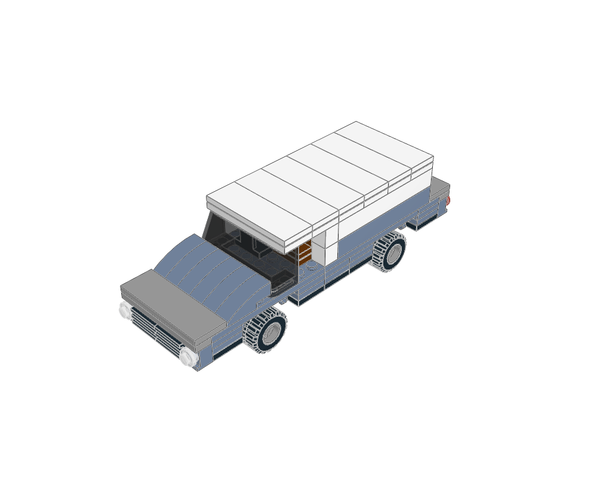
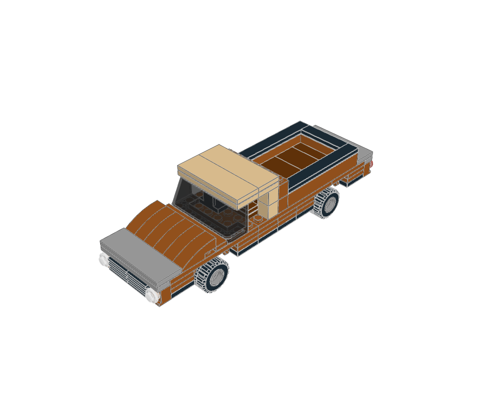

# System vehicle construction examples

Three editable starting points for designing vehicles around conventional
wheel-pin running gear. Read the [vehicle workflow](../../docs/agent/vehicles.md)
before adapting them. X is width, -Z is forward and the road is Y=0.

| Example | Construction lesson | Editable source |
|---|---|---|
| [Grand tourer](grand-tourer/home.png) | Long curved bonnet, inset raked glazing, short rounded roof and quiet rear deck | [MPD](grand-tourer/grand-tourer.mpd), [plan](grand-tourer/scene.plan.json) |
| [Delivery van](delivery-van/home.png) | Six-wide cab, seats and steering, a pale cargo volume and restrained blue lower body | [MPD](delivery-van/delivery-van.mpd), [plan](delivery-van/scene.plan.json) |
| [Workshop pickup](pickup/home.png) | Distinct cab and open bed, tiled wood-colour floor and capped bed rails | [MPD](pickup/pickup.mpd), [plan](pickup/scene.plan.json) |






Each folder includes its design brief, assembly validation, vehicle check, Python
BOM, LeoCAD BOM comparison and six render views. Reports carry the MPD SHA-256
so stale evidence is detectable. See [the visual review](visual-review.md) for
opened views, actual revisions and remaining physical limitations.

```sh
./ldraw-agent examples --family vehicle
./ldraw-agent vehicle plan pickup --output output/my-pickup.plan.json
./ldraw-agent vehicle wheels touring
.venv/bin/python examples/vehicle-atlas/generate.py --outdir output/vehicle-atlas --render
```

The generator rebuilds sources and evidence; it never claims to perform human
visual review. A plan/MPD change requires reopening the new renders. Without
`--render`, old previews and BOM comparisons in a reused output directory may be
stale: check their hashes. A single-design run creates a catalog for that selection.
The catalog links existing render evidence only when it matches the new MPD hash.

The reusable implementation is [vehicles.py](../../ldraw_tools/vehicles.py).
`axle()` exposes a deck anchor at the real wheel holder's stud body plane.
`fascia()` provides supported side-stud lamps/grille geometry;
`tiled_strip()` and `smooth_deck()` help control surface seams. These are
construction examples, not universal templates or retail inventory guarantees.
The cabins demonstrate visual space and controls; minifigure fit is untested.
