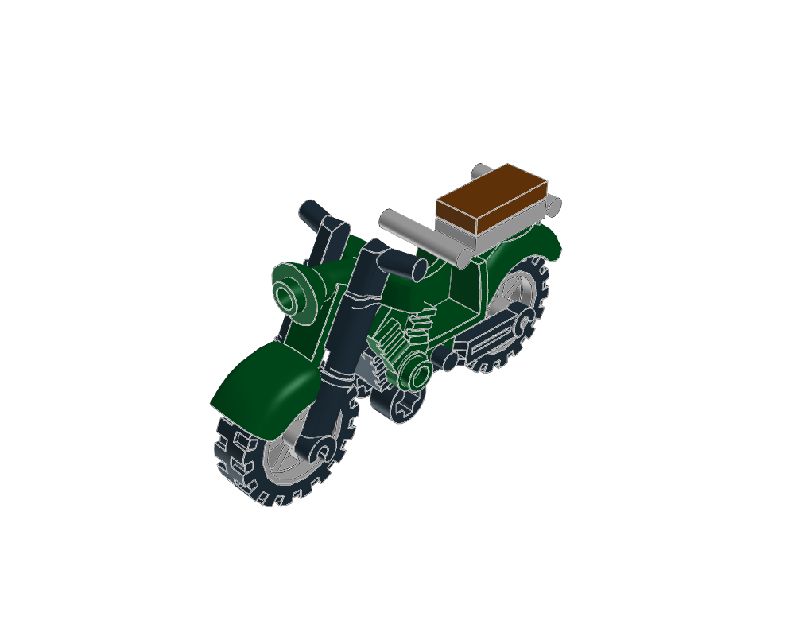
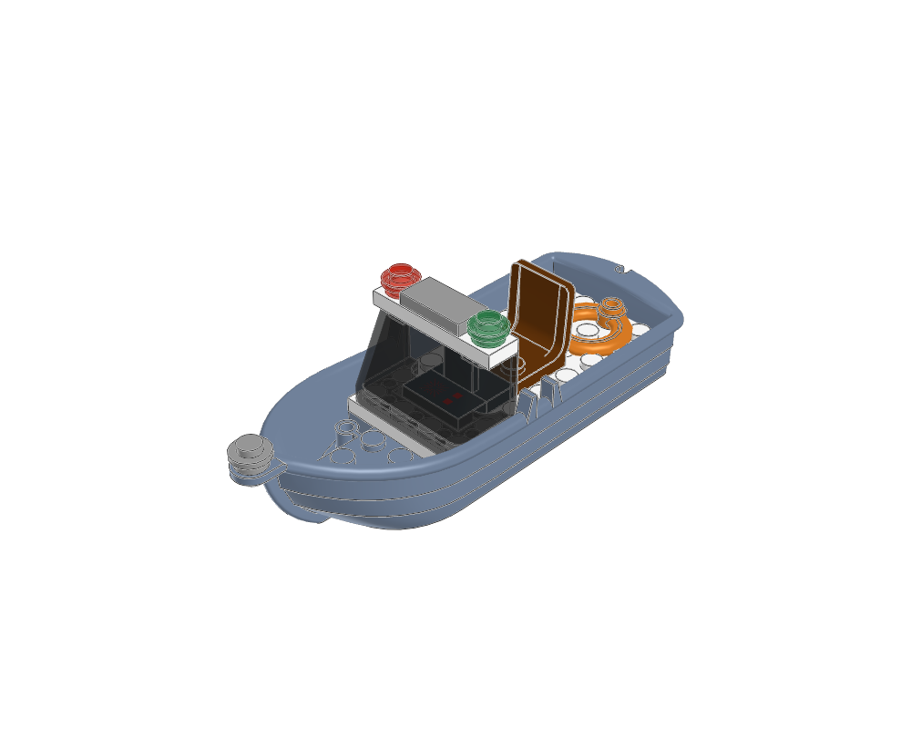

# System vehicle construction examples

Two editable designs remain: a touring motorcycle and a harbour launch. The road
vehicles and the courier jet are [archived](../archive/README.md) because they fail
`check`; start cars and trucks from the [small car recipe](../../docs/reference/small-car.md).
Six reusable fitting recipes demonstrate
actual seats, steering controls, printed instruments, cargo fittings and engines.
Start with the [vehicle workflow](../../docs/agent/vehicles.md), select the defining
parts, and build the surrounding structure to their measured interfaces.
Technic models and mechanisms remain outside this collection.

| Example | Dedicated parts and construction lesson | Editable source |
|---|---|---|
| [Touring motorcycle](touring-motorcycle/home.png) | 50859b frame/handlebars, 85983 vintage fairing, matched wheels/tyres and luggage rack | [MPD](touring-motorcycle/touring-motorcycle.mpd), [plan](touring-motorcycle/scene.plan.json) |
| [Harbour launch](harbour-launch/home.png) | 2551 hull, seat and helm, windscreen, navigation lights and life ring | [MPD](harbour-launch/harbour-launch.mpd), [plan](harbour-launch/scene.plan.json) |





## Reusable details

| Recipe | Interface / source |
|---|---|
| [Driver cockpit](details/driver-cockpit/home.png) | 2×6 floor, real seat and steering wheel; [plan](details/driver-cockpit/scene.plan.json) |
| [Pilot cockpit](details/pilot-cockpit/home.png) | 2×8 floor, printed instrument slope and hinged stick; [plan](details/pilot-cockpit/scene.plan.json) |
| [Wing mirror](details/wing-mirror/home.png) | Sideways tile on a measured recessed stud; [plan](details/wing-mirror/scene.plan.json) |
| [Cargo chest](details/cargo-chest/home.png) | 3×4 pallet, odd-width stud lattice; [plan](details/cargo-chest/scene.plan.json) |
| [Navigation lights](details/navigation-lights/home.png) | Four-stud crossbar, red port / green starboard; [plan](details/navigation-lights/scene.plan.json) |
| [Jet engine pod](details/jet-engine-pod/home.png) | Native shell/core fit, upper mounting plane; [plan](details/jet-engine-pod/scene.plan.json) |

Each detail directory contains a `recipe.json` with its envelope and attachment
contract. Compose its exported sections, or call
`ldraw_tools.vehicle_details.detail_module()` from a Python generator. The complete
vehicles demonstrate these fittings in context, adapting layouts to their cabins.
Do not paste a cockpit floor through an existing deck or a chest onto smooth tiles.

## Frames and checks

All designs face -Z, with X across and negative Y up. Road vehicles and the
motorcycle meet the road at Y=0. The launch uses its **hull floor**, not a waterline,
as Y=0. Use the matching `vehicle check --profile` from each design brief.

```sh
./ldraw-agent examples --family vehicle --limit 2
./ldraw-agent examples --family vehicle --details --limit 6
./ldraw-agent vehicle plan harbour-launch --output output/launch.plan.json
./ldraw-agent vehicle details driver-cockpit --output output/cockpit.plan.json
./ldraw-agent vehicle check output/launch.mpd --profile watercraft
.venv/bin/python examples/vehicle-atlas/generate.py --outdir output/vehicle-atlas --render
```

Each complete model includes a design brief, assembly validation, family review,
Python BOM, LeoCAD BOM comparison and six views. Details include the same evidence
except the whole-vehicle family check. Reports identify the exact MPD SHA-256.
Read [the visual review](visual-review.md) for findings and physical limitations.

The generator never claims to perform visual review. A changed plan/MPD requires
opening its new renders. Without `--render`, only matching existing image/BOM
hashes are linked in the catalog. `--name NAME` or `--detail NAME` generates a
selected set and replaces the catalog with that selection; omit both to rebuild
all examples. No retail colour availability, dynamic capability or figure fit is
promised. These are construction lessons for adaptation to the user's brief.
