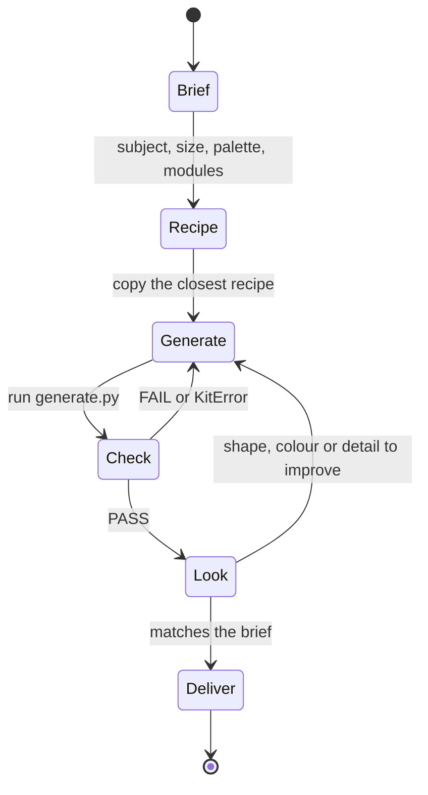

# Build an LDraw model

Build the model the user asks for and deliver its `.mpd`, the generator that produces it, a passing `check` and reviewed views. Match the requested subject, scale, palette and level of detail. Do not quietly shrink a detailed request into a few bricks. Treat looks as part of the job too: a recognisable silhouette, a controlled palette and one clear focal feature. When no subject is given, choose one and say what you chose.

You choose parts and how they connect; the [construction kit](docs/agent/kit.md) computes every position and rotation and checks each placement as you make it. Work in this loop:



## 1. Brief

Run `./ldraw-agent doctor` once. Then write `output/NAME/brief.md` with:
- the subject and its size in studs;
- 3 or 4 palette colours with their roles;
- the focal feature and two supporting features;
- the modules, as a Mermaid flowchart. Name each node after the top-level plan id you will use, and say how it attaches on its edge, for example `cab -->|studs| chassis`.

For a large model, plan modules (floors, wings, axles, engines) and finish them one at a time.

## 2. Recipe and parts

Open the [recipe catalog](docs/reference/README.md) and copy the closest recipe into `output/NAME/generate.py`. Recipes are tested generators for buildings, cars, Technic frames, gear trains and spaceships; combine them.

```sh
./ldraw-agent search parts 'slope 45 2 x 4'          # real part numbers by description
./ldraw-agent catalog parts 'arch' --category arches   # browse a family
./ldraw-agent ports 3001 32524 2780                    # how a part connects: port names, axes, body box
./ldraw-agent colours tan                              # colour names and codes
```

Never invent a part number. Read a part's size from `ports` (its body box), not from its name. For semantic search use `jev-rerank`: check that it is available first, and if it is not, use `--engine fts` and say so ([reference discovery](docs/agent/reference-discovery.md)).

## 3. Generate with the kit

```python
from ldraw_tools.kit import Model

m = Model("NAME", "One-line description")
base = m.place("3811", "Bright_Green", cell=(0, 0), level=0)               # grid: stud cell, level in plates
wall = m.wall("Tan", start=(2, 2), length=8, courses=4, level=base.top)    # running-bond wall (list of parts)
post = m.place("32000", "Red", cell=(2, 2), level=wall[-1].top)            # Technic brick 1x2 on the wall
pin = m.mate("2780", "Black", "pin[0]", to=post.port("pin_hole[0]"))       # connect real ports
m.mate("32524", "Blue", "pin_hole[0]", to=pin.port("pin[2]"), along="UP")  # Beam 7 standing on that pin
# m.add(ref, colour, at=(x, y, z), axes={"y": "X", "z": "-Z"}) places explicitly in LDU when nothing fits
m.save("output/NAME/NAME.mpd")                                             # writes MPD + plan, prints check
```

Rules:
- **Stacking.** Stack with `level=part.top`. Never compute heights, signs or half-stud offsets yourself.
- **Ids.** Give every important placement an `id=`. Reports name parts by these ids.
- **Modules.** Build each module as a `section`, or as a block of ids sharing a prefix.
- **Joins.** Join every part to a neighbour. Two plates side by side need a part across the seam, and every Technic beam needs a pin or axle into another layer.
- **Declarations.** Mark a deliberately loose object `free="reason"` and a deliberate overlap `overlap="reason"`.
- **Sideways, angled, symmetric.** Build on a side or tilted face with `place(..., on=part.port("stud[k]"))`, hinge parts with `hinge(..., angle=)`, and build one side of a symmetric model, then `mirror(parts, about=hull)`.
- **Style.** `Model(..., family="spaceship")` (or `building`, `car`, `aircraft`, `boat`) compares how your model is built with official LEGO models of that family. Ships made of stacked bricks read as buildings.

## 4. Check and fix

Run `.venv/bin/python output/NAME/generate.py`. A `KitError` stops at the line that caused it and suggests the fix. `save()` then prints the full verdict, which must be `PASS`:

| `check` says | Fix |
|---|---|
| `floating [n]: ids` | Connect that group: bridge the seam, add the pin or axle, or attach the module. |
| `collision ~N LDU: a × b` | Move one part, usually by one plate (8) or one stud (20). |
| `badly seated: a sunk into / floating above b` | Use `level=b.top`. |
| `duplicate` | Delete one. |
| `review ...` | Interlocking parts (gears, hinges, glass in frames). Look at them, but they don't fail. |

`./ldraw-agent check output/NAME/NAME.mpd --graph --intended output/NAME/brief.md` compares the module connections you built with the ones in your brief.

## 5. Look and improve

```sh
./ldraw-agent look output/NAME/NAME.mpd                       # one sheet: home, front, right, top
./ldraw-agent look output/NAME/NAME.mpd --problems            # floating magenta, collisions red
./ldraw-agent look output/NAME/NAME.mpd --focus roof-left     # close-up on one id
```

Open the sheet and compare it with the brief:
- silhouette and proportions;
- the palette;
- whether the focal feature reads at a glance;
- bare sides and backs;
- anything that looks unsupported.

Change the generator, rerun it, and look again. The front of a model faces `-Z`. In the `top` view the front is at the bottom.

## 6. Deliver

Run `./ldraw-agent deliver output/NAME/NAME.mpd`. It runs the final check, renders 7 views, compares BOMs, exports a GLB and writes `delivery/summary.md`.

Then fill in `output/NAME/friction.md`, which `deliver` creates: four short answers that improve the tools for the next build.

In your final answer:
- link the summary, the generator and the MPD;
- state the part count and the check verdict;
- say what is not done, if anything.

Re-run `deliver` after any change.

## Rules

- Work in `output/` only. `data/` and the parts library are read-only.
- Keep every fix in the generator so a rerun reproduces it. Never paste generated coordinates into a plan by hand.
- To reuse a section of a reference model, use `./ldraw-agent extract` and keep its author and licence lines ([extraction](docs/agent/tooling.md#study-and-extract-complex-references)). Copied work is not your design; say what you reused.
- A passing check means connected and free of collisions. It does not mean strong or retail-available, so report what you could not verify.
- If you write a helper script, say so in your final answer: it is a sign the kit or a recipe is missing something.

## When you need more

| Topic | Read |
|---|---|
| All kit verbs, conventions and errors | [kit](docs/agent/kit.md) |
| Proportions, palettes, detail | [visual design](docs/agent/visual-design.md) |
| Vehicles, aircraft, boats | [vehicles](docs/agent/vehicles.md), `./ldraw-agent vehicle check` |
| Spaceships | [spaceships](docs/agent/spaceships.md) |
| Technic structures and mechanisms | [technic](docs/agent/technic.md), [mechanisms](docs/agent/mechanisms.md), [design patterns](docs/agent/technic-design.md) |
| Large scenes and modules | [complex models](docs/agent/complex-models.md) |
| Searching parts and reference models | [reference discovery](docs/agent/reference-discovery.md) |
| Every command, JSON plans and `build` | [tool reference](docs/agent/tooling.md) |
| LDraw file rules | [LDraw reference](docs/agent/ldraw-reference.md), `./ldraw-agent spec 'TOPIC'` |
| Lessons from earlier builds | [lessons](docs/reference/lessons.md) |
